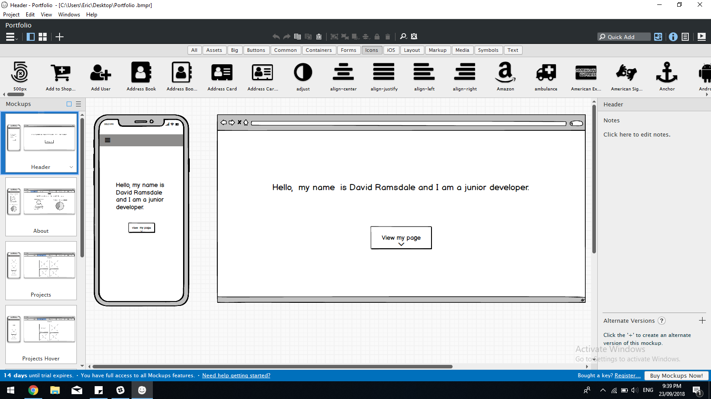
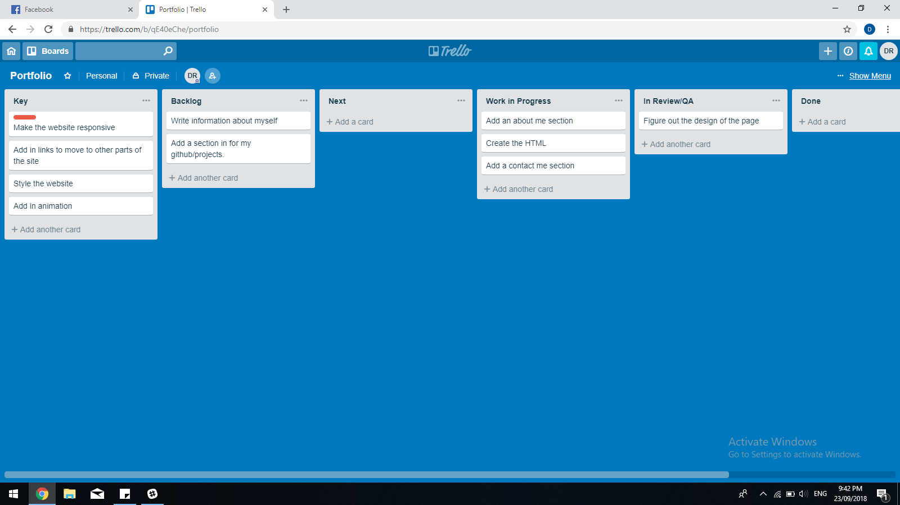

# Portfolio-Page

Link to page
https://davidramsdale.github.io/Portfolio-Page/

Github respiratiry: https://github.com/DavidRamsdale/Portfolio-Page

## The Purpose
The purpose of this site is to allow me to demenstrate my skills through my projects, previous work experience and even my site itself.

My entire portfolio page was created by using a combination of flex-box and css grid, some of the features of my page include a toolbar which displays a background when scrolling down. This was acheived by using Jquerys.

The target audience for this site is any potential employer or anyone who is just interested to keep up with my work that I will continue to upload to the site.

The tech stack involved was html, css and sass.

## Design process:
The design of the website itself was firstly created and managed using bolsamiq.

## Project plan:
Trello was used to help with managing every task that was involved with creating the site, a few snap shots of the process are shown below using trello.
There was a lot of features that I did want to add into the webpage but unfortunately there was not enough time for me be able to implement them at this stage.  The first priority was for me to have the layout and responsiveness to be finished. Adding in the information and styling came next and with any extra time I had after that I would add in some additional features.

